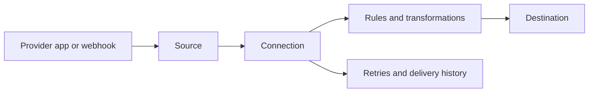

# FastHook

FastHook is a webhook gateway and event-delivery platform for receiving, inspecting, transforming, routing, and reliably delivering events between services.

[Website](https://www.fasthook.io) · [Dashboard](https://dashboard.fasthook.io) · [Documentation](https://www.fasthook.io/docs) · [Pricing](https://www.fasthook.io/pricing)

## What FastHook does

FastHook gives teams one place to manage the complete event path:

- Receive HTTP webhooks through dedicated Source URLs.
- Create Provider Sources for services such as Google Workspace, Slack, and GitHub.
- Route one Source to one or many Destinations.
- Filter, transform, delay, deduplicate, and retry events per Connection.
- Inspect incoming requests, normalized events, delivery attempts, and failures.
- Replay failed traffic without asking the original provider to send it again.
- Keep large payloads outside the operational database while preserving searchable metadata.

## Why FastHook

Webhook integrations often start as a single endpoint and quickly become operational infrastructure. Teams need to verify signatures, absorb traffic spikes, prevent duplicates, store payloads, retry failures, and understand what happened after an event was received.

FastHook is designed to make those responsibilities explicit and observable:

- **Fast acknowledgement** — receive and durably accept events before downstream work begins.
- **Reliable delivery** — queue-based processing, retry policies, and dead-letter handling isolate temporary failures.
- **Flexible routing** — connect Sources and Destinations without coupling provider code to delivery code.
- **Operational visibility** — inspect request headers, bodies, events, attempts, and errors from the dashboard.
- **Safe replay** — retry or replay events with idempotency and deduplication controls.
- **Provider-aware security** — verify provider signatures and manage connected accounts separately from Source configuration.

## Sources

FastHook supports two Source families.

### Provider app Sources

Provider Sources connect to an external application and emit a normalized event when the selected activity occurs.

| Provider | Delivery model | Example Source types |
| --- | --- | --- |
| Google Sheets | Polling and Google notification channels | New row, worksheet, comment, or update |
| Gmail | Polling with Gmail query and label filters | New email or attachment received |
| Google Drive | Polling and push notifications where supported | File or folder created, modified, or moved |
| Google Calendar | Google notification channels with polling safety paths | Event created, updated, started, or cancelled |
| Slack | Slack Events API | Messages, mentions, reactions, files, channels, users, and workspace events |
| GitHub | Signed GitHub App webhooks | Pushes, pull requests, issues, releases, workflows, security events, and more |

Provider credentials are managed independently, can be reused by multiple Sources, and can be revoked from FastHook account settings.

The FastHook GitHub App can be installed for all repositories or limited to selected repositories: [Install or view FastHook.io on GitHub](https://github.com/apps/fasthook-io).

### Webhook endpoint Sources

Webhook Sources expose a dedicated FastHook URL for any service that can send HTTP requests. They support optional authentication, request verification, proxying, custom responses, and traffic inspection.

Use a Webhook Source when a provider does not require an account connection or when you want direct control over the incoming request contract.

## Core concepts

| Concept | Purpose |
| --- | --- |
| **Source** | Receives an event from a provider app or dedicated webhook endpoint. |
| **Destination** | Defines the service or endpoint that should receive processed events. |
| **Connection** | Links a Source to a Destination and owns delivery behavior. |
| **Rule** | Filters, delays, deduplicates, retries, or otherwise controls a Connection. |
| **Transformation** | Changes headers, payloads, or structure before delivery. |
| **Request** | Preserves the original inbound HTTP request for inspection and replay. |
| **Event** | Represents an accepted event moving through the delivery pipeline. |
| **Fixture** | Stores a reusable example payload for testing transformations and Connections. |
| **Alert** | Surfaces delivery, provider-channel, or operational failures that need attention. |

## Quick start

1. Sign in to the [FastHook dashboard](https://dashboard.fasthook.io).
2. Create a **Provider app** Source or a **Webhook endpoint** Source.
3. Add a Destination.
4. Create a Connection between the Source and Destination.
5. Add optional filters, transformations, delays, deduplication, or retry behavior.
6. Send an event and inspect it in **Requests**, **Events**, or the Source run history.

For provider integrations, connect the account requested by the Source wizard. For generic webhooks, copy the generated Source URL into the sending service.

## Reliability model

FastHook separates ingestion from downstream delivery:

1. The inbound request is authenticated or its provider signature is verified.
2. The exact payload is accepted and stored.
3. Metadata and idempotency state are recorded.
4. Matching Sources and Connections are resolved.
5. Delivery work is placed onto queues.
6. Each Destination attempt is tracked independently and retried according to policy.

This design lets FastHook acknowledge providers quickly while slower or unavailable Destinations recover asynchronously.

## Security

- Provider webhook signatures are verified before events are accepted.
- Provider credentials and application secrets are stored separately from public Source configuration.
- Connected accounts can be revoked from the dashboard.
- GitHub App installations can be restricted to selected repositories.
- Google and Slack permissions are requested through their standard authorization flows.
- Idempotency and deduplication controls help prevent repeated downstream effects.
- Sanitized sharing can be used when request details need to be shared without exposing sensitive values.

Always review the permissions requested by a provider integration and grant access only to the accounts, workspaces, or repositories required for that Source.

## Product surface

- [www.fasthook.io](https://www.fasthook.io) — product website, integration pages, documentation, and pricing.
- [dashboard.fasthook.io](https://dashboard.fasthook.io) — Sources, Destinations, Connections, transformations, requests, events, fixtures, and alerts.
- `api.fasthook.io` — control APIs, provider callbacks, and webhook ingestion endpoints.
- `hook-*.fasthook.io` — dedicated public webhook Source endpoints.

## Repository map

The broader FastHook project is split into focused repositories:

- [`alencmanis/fasthook.io`](https://github.com/alencmanis/fasthook.io) — public project overview and ecosystem entry point.
- [`alencmanis/fasthook`](https://github.com/alencmanis/fasthook) — backend pipeline, provider adapters, workers, storage, and control API.
- [`alencmanis/fasthook-ui`](https://github.com/alencmanis/fasthook-ui) — public website and dashboard applications.
- [`alencmanis/fasthook-cli`](https://github.com/alencmanis/fasthook-cli) — command-line tooling.
- [`alencmanis/fasthook-widget`](https://github.com/alencmanis/fasthook-widget) — browser extension and side panel for request and event visibility.

Each repository may have its own setup instructions, release cadence, and availability.

## Integrations

FastHook is building a consistent Provider Source model so additional providers can be added without changing the core Source → Connection → Destination architecture.

Current integration work includes:

- [Slack integration](https://www.fasthook.io/integrations/slack)
- Google Sheets, Gmail, Google Drive, and Google Calendar
- [FastHook.io GitHub App](https://github.com/apps/fasthook-io)

## Project status

FastHook is under active development. Product behavior, provider permissions, Source types, and public APIs may evolve as the platform expands.

Bug reports and focused feature requests are welcome through the relevant repository's GitHub Issues.

## License

This repository does not currently include an open-source license. Unless a specific FastHook repository states otherwise, its code and content remain subject to applicable copyright law.
